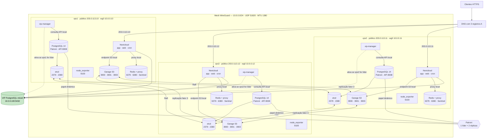
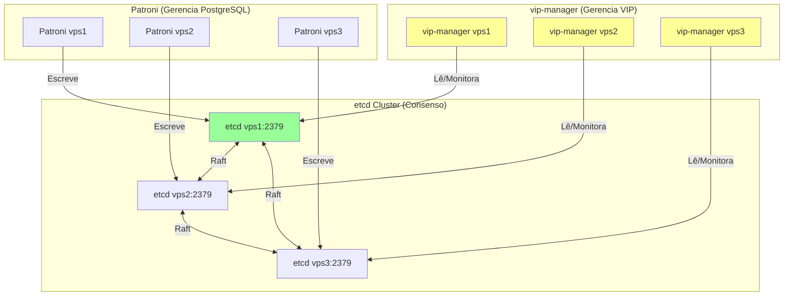
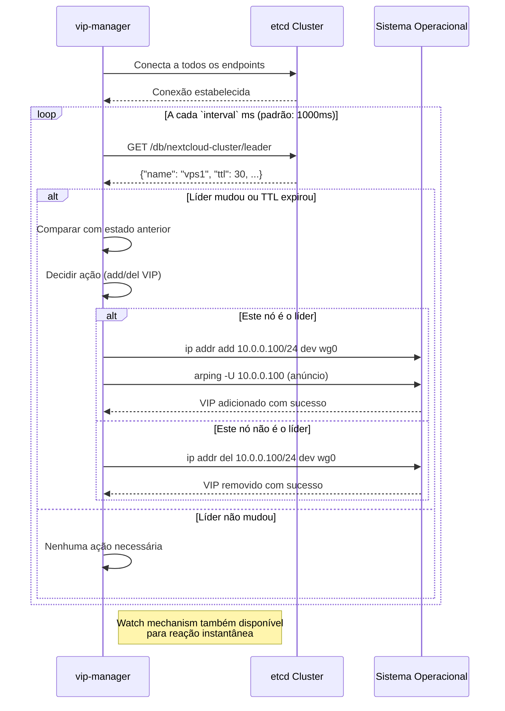

# Nextcloud HA Cluster - Ansible + vip_patroni

Deploy a highly available Nextcloud cluster with automatic database failover using WireGuard for private networking and vip_patroni for VIP management.

O OnlyOffice e habilitado para os hosts do grupo `resiliencia` via
`nextcloud_onlyoffice_enabled`, usando `/ds-vpath/` por tras do proxy reverso.

## Projetos utilizados

Esta role combina alguns projetos e componentes externos para entregar o
cluster HA:

| Projeto | O que resolve |
| --- | --- |
| [`LibreCodeCoop/nextcloud-docker`](https://github.com/LibreCodeCoop/nextcloud-docker) | Entrega a stack do Nextcloud em Docker Compose, com `app`, `web`, `cron`, Redis, PostgreSQL e integração com Garage S3. |
| [Patroni](https://github.com/patroni/patroni) | Faz a alta disponibilidade do PostgreSQL, com eleição de líder e failover automático. |
| [Cybertec vip-manager](https://github.com/cybertec-postgresql/vip-manager) | Move o VIP do banco para o nó líder atual, mantendo o endpoint `10.0.0.100:5432` estável para o Nextcloud. |
| [etcd](https://github.com/etcd-io/etcd) | Guarda o estado distribuído usado por Patroni e vip-manager para coordenar líder, réplicas e VIP. |
| [WireGuard](https://www.wireguard.com/) | Cria a rede privada entre as VPS para tráfego interno seguro entre banco, cluster e monitoramento. |
| [Garage](https://garagehq.deuxfleurs.fr/) | Fornece armazenamento S3 distribuído para objetos do Nextcloud, reduzindo a dependência de `data/` local. |
| [Garage UI](https://github.com/Noooste/garage-ui) | Fornece uma interface web local para administrar o cluster Garage sem expor a aplicação na rede pública. |
| [OnlyOffice Document Server](https://github.com/ONLYOFFICE/DocumentServer) | Habilita edição colaborativa de documentos via `/ds-vpath/` atrás do proxy reverso. |
| [Redis](https://github.com/redis/redis) | Centraliza cache distribuído, sessões e file locking do Nextcloud. |
| [Node Exporter](https://github.com/prometheus/node_exporter) | Expõe métricas de host para monitoramento externo. |

## Comeco rapido
Se você está começando do zero, use a abordagem completa:

1. Instale a base:
```bash
ansible-playbook playbooks/00-nextcloud-install.yml
```
2. Configure a rede privada:
```bash
ansible-playbook playbooks/01-wireguard.yml
```
3. Configure o banco HA + VIP:
```bash
ansible-playbook playbooks/02-patroni.yml
```
4. Configure o Nextcloud HA:
```bash
ansible-playbook playbooks/03-nextcloud.yml
```
5. Configure o OnlyOffice em `/ds-vpath/`:
```bash
ansible-playbook playbooks/07-onlyoffice.yml
```
6. Aplique o firewall:
```bash
ansible-playbook playbooks/04-firewall.yml
```

## Troubleshooting OnlyOffice

Se o editor abrir, mas o Nextcloud mostrar erros como:

- `Error while downloading the document file to be converted`
- `Error when trying to connect`
- `Data directory protected`

verifique primeiro estes dois pontos no cenário com `/ds-vpath/`:

1. O Nextcloud precisa confiar no hostname interno usado pelo Document Server.
   Neste role, o `StorageUrl` aponta para `http://web/`, então `web` deve
   existir em `trusted_domains` junto com o domínio público.
2. O Document Server precisa enviar o JWT em `Authorization` para o
   `StorageUrl`. Neste role, `JWT_IN_BODY` fica desabilitado para que o
   endpoint `empty` e os downloads convertidos funcionem corretamente.
3. O Document Server precisa de um cache gravável em
   `/var/www/onlyoffice/documentserver/.cache`. Sem esse volume, o serviço pode
   subir com `502 Bad Gateway` no `healthcheck` e falhar ao baixar documentos.

Para validar a correção:

```bash
ssh <host>
sudo docker exec -u www-data nextcloud-docker-app-1 php occ config:system:get trusted_domains
sudo docker exec -u www-data nextcloud-docker-app-1 php occ onlyoffice:documentserver --check
curl -skI https://nextcloud.example.invalid/ds-vpath/healthcheck
```

O resultado esperado é:

- `trusted_domains` contendo o domínio público e `web`
- `JWT_IN_BODY=false` no Document Server
- `onlyoffice:documentserver --check` retornando conexão bem-sucedida
- `healthcheck` respondendo `HTTP/2 200`

## Garage S3 e armazenamento compartilhado

O cluster usa o `docker-compose-garages3.yml` do projeto
`LibreCodeCoop/nextcloud-docker`. O Compose fornece `app`, `web`, `cron`, Redis,
PostgreSQL e Garage; nesta role os serviços locais `db` e `redis` são
desativados pelo override, porque o banco vem do Patroni/VIP e o Redis é
compartilhado entre os nós.

O Garage escuta na rede do host e replica os objetos entre os três nós. Antes
de executar o playbook, crie o arquivo `group_vars/vault.yml` a partir do
exemplo e proteja-o com `ansible-vault`:

```bash
cp group_vars/vault.yml.example group_vars/vault.yml
ansible-vault encrypt group_vars/vault.yml
```

Os valores `vault_garage_rpc_secret`, `vault_garage_admin_token`,
`vault_garage_metrics_token`, `vault_garage_s3_key_id` e
`vault_garage_s3_secret` são usados por todos os nós. A chave S3 deve ser
gerada uma vez pelo Garage e depois armazenada no Vault; a role usa
`garage key import` para reimportar essa chave válida no cluster.

O hook `.docker/garages3.config.php` do projeto configura o `objectstore`
primário com `use_path_style = true`. Por padrão, cada nó usa o próprio
`wg_ip` como `garage_s3_endpoint_host`, evitando que todos os containers PHP
dependam de um único membro do cluster para acessar o S3. Para tolerar a falha
isolada do serviço Garage em um nó que continua servindo web, use um VIP,
HAProxy local ou DNS interno com health check entre os três nós.

O `vip-manager` continua instalado diretamente no host via systemd, pois ele
precisa adicionar/remover o VIP local com privilégios de rede. O container
Nextcloud acessa o PostgreSQL pelo VIP `10.0.0.100` através do
roteamento do host.

Uploads chunked, previews e thumbnails ainda usam espaço temporário local em
cada nó antes de serem persistidos. Reserve espaço suficiente em cada VPS e
monitore esse filesystem.

O Redis continua obrigatório para cache distribuído e file locking. A role
mantém `redis_host`, `redis_port` e `redis_password` parametrizados; neste
cluster cada nó expõe um proxy TCP local em `wg_ip:6380` que consulta o
Redis Sentinel e encaminha para o master atual.

O WireGuard usa MTU 1380 por padrão. Valide o valor com testes de upload de
arquivos grandes antes de colocá-lo em produção.

As portas internas do Garage são `3900/tcp` para S3, `3901/tcp` para RPC e
`3903/tcp` para a API administrativa/métricas. Elas não devem ser publicadas
na Internet; o firewall libera essas portas somente na rede WireGuard.

O `garage-ui` atual da Noooste requer um Garage compatível com a API v2.1.0+
para completar o probe da API administrativa. O cluster deste repositório
foi ajustado para usar `dxflrs/garage:v2.3.0`, o que atende esse requisito e
permite subir o role de `garage-ui` no `motoko` via túnel local.

Edite `inventory/hosts.yml` e `group_vars/all.yml`, depois valide o SSH:

```bash
ansible-galaxy collection install -r requirements.yml
ansible all -m ping
ansible-playbook site.yml
ansible-playbook tests.yml
```

O playbook administrativo mantém as recomendações do Nextcloud consistentes
nos três servidores PHP: APCu local, Redis distribuído e para file locking,
proxies e cabeçalhos encaminhados, URLs HTTPS, região telefônica, janela de
manutenção e um `serverid` exclusivo por VPS. Como este cluster não usa ExApps,
o AppAPI fica desabilitado; a imposição de 2FA fica habilitada e exige que os
usuários cadastrem um provedor no próximo login.

```bash
ansible-playbook playbooks/06-nextcloud-admin.yml
```

As migrações caras de mimetypes não rodam em cada deploy. Após um upgrade,
execute-as uma única vez no nó primário:

```bash
ansible-playbook playbooks/06-nextcloud-admin.yml \
  -e nextcloud_run_expensive_mimetype_migrations=true
```

A senha usada pela configuração Redis é lida de `REDIS_HOST_PASSWORD` dentro
do container `app`; assim, a configuração do Nextcloud não diverge do segredo
que o Compose realmente injetou.

| Record | Type | Value | TTL | Purpose |
| --- | --- | --- | --- | --- |
| `nextcloud.example.invalid` | A | `203.0.113.10` | 60s | Tráfego web do Nextcloud |
| `nextcloud.example.invalid` | A | `203.0.113.11` | 60s | Tráfego web do Nextcloud |
| `nextcloud.example.invalid` | A | `203.0.113.12` | 60s | Tráfego web do Nextcloud |

O VIP do banco (`10.0.0.100`) é interno ao WireGuard e gerenciado
automaticamente pelo `vip-manager`, então não precisa de DNS público.

## Entrada pública sem ferramenta externa

Como as VPS estão em redes públicas diferentes, um VIP público por ARP não
funciona entre elas. Sem ferramenta externa de failover, o desenho viável é
active-active na camada web: o DNS publica os três IPs públicos, e todos os nós
precisam responder o mesmo domínio com o mesmo Nextcloud.

Isso remove a dependência de um único servidor web, mas não remove
automaticamente do DNS uma VPS desligada. Alguns clientes tentam outro A record
quando uma conexão falha, outros podem respeitar cache ou falhar até nova
tentativa. Para failover determinístico na entrada pública seria necessário um
recurso externo ao trio de VPS, como IP flutuante do provedor, balanceador com
health check, DNS dinâmico ou BGP.

Validação rápida:

```bash
dig +short A nextcloud.example.invalid
ansible-playbook tests.yml --tags external -e test_validate_certs=false
```

## Melhorias Para Produção
Pontos que merecem atenção antes de ir para produção:

- O etcd continua sendo um ponto crítico de disponibilidade. Com 3 VPS, a perda de 2 nós derruba o quorum. Se a operação exigir mais tolerância, considere um 4º nó apenas para etcd como árbitro.
- O cenário de split-brain precisa de fencing explícito. O TTL do `leader` ajuda, mas não substitui watchdog ou STONITH-like se a rede do líder cair com o processo vivo.
- O firewall deve ser configurado como etapa própria e não apenas via `01-wireguard.yml`, para evitar exposição acidental de `2379`, `2380`, `8008` e `5432`.
- O WireGuard precisa de monitoramento do handshake e alerta caso o túnel pare silenciosamente.
- Falta observabilidade automatizada. Idealmente, inclua Prometheus, node_exporter e alerta quando o VIP mudar de nó ou quando um endpoint público parar de responder.
- Backup e restore devem entrar no fluxo principal, não só em procedimento manual. Um caminho com `pgBackRest` ou `pg_dump` agendado é o mínimo.
- Sem uma ferramenta externa para a entrada pública, DNS round-robin não entrega failover determinístico. Ele só funciona bem se os três proxies estiverem saudáveis e se o cliente tentar outro A record ao encontrar falha.

## Segurança e Firewall
O playbook `04-firewall.yml` consolida as regras públicas mínimas:

- Permite `22/tcp`, com possibilidade de restringir por `ssh_allowed_cidr`.
- Permite `80/tcp` e `443/tcp` para o Nextcloud.
- Permite `51820/udp` para o WireGuard.
- Mantém `2379`, `2380`, `8008` e `5432` acessíveis apenas pela rede privada do WireGuard.

Se quiser restringir SSH por IP, defina `ssh_allowed_cidr` em `group_vars/all.yml` antes de aplicar o playbook.

## Alternativa: HAProxy no líder
Essa alternativa pode ser usada quando você quer manter o balanceamento no nível do nó líder, sem alterar DNS por API.

Resumo do comportamento:
- O HAProxy roda nos 3 nós.
- Só o nó líder mantém o HAProxy escutando na porta `443`.
- O Patroni decide isso via `on_role_change`: quando um nó vira líder, sobe o HAProxy; quando vira réplica, derruba o HAProxy.
- O Nextcloud continua rodando em todos os nós.
- O DNS aponta para os 3 IPs com TTL baixo, por exemplo `60s`.
- O cliente tenta os 3 IPs e só o líder responde na `443`.

Fluxo esperado:
1. O Patroni promove um nó.
2. O callback `on_role_change` executa `systemctl start haproxy` no líder.
3. Nos réplicas, o mesmo callback executa `systemctl stop haproxy`.
4. O DNS continua apontando para os 3 nós.
5. O tráfego HTTPS cai no líder atual sem depender de VIP.

Exemplo de teste manual:
```bash
# Verificar em qual nó o Patroni está líder
patronictl -c /etc/patroni/patroni.yml list

# Confirmar que só o líder está escutando na 443
ss -lntp | grep ':443'

# Forçar failover e observar a troca
patronictl -c /etc/patroni/patroni.yml failover nextcloud-cluster

# Conferir se o HAProxy subiu no novo líder e foi derrubado no antigo
journalctl -u haproxy -f
```

Checklist de validação:
- `haproxy` está instalado em todos os nós.
- O callback `on_role_change` chama `start` no líder e `stop` nos réplicas, somente para o `haproxy`.
- O DNS tem 3 registros A, um para cada nó.
- O TTL do DNS está baixo o suficiente para acelerar reconvergência.
- O líder responde na `443` e os réplicas não.
- Após failover, o novo líder passa a responder sem intervenção manual.

Observação: este modelo também depende de comportamento de cliente/resolver ao
lidar com múltiplos A records. Ele não é mais determinístico que o active-active
simples, mas pode ser útil em ambientes onde se aceita esse compromisso.

## Teste Failover
```bash
# Check current status
ansible-playbook tests.yml

# Trigger controlled failover (homologation only)
ansible-playbook tests.yml --tags failover \
  -e test_allow_destructive=true \
  -e test_failover_candidate=vps2

# Or use patronictl directly
patronictl -c /etc/patroni/patroni.yml failover nextcloud-cluster
```

## Recuperacao do incidente PostgreSQL (2026-08-13)

O `ansible -m ping` confirmou apenas o acesso SSH. O erro do Nextcloud era
`SQLSTATE[08006]` ao conectar em `10.0.0.100:5432`. A causa foi o cluster
PostgreSQL padrao do pacote Debian (`postgresql@17-main`) iniciado no host e
ocupando a porta `5432`; o Patroni ficou sem conseguir iniciar seus membros.
Esse cluster padrao era vazio (`/var/lib/postgresql/17/main`, somente os bancos
de template). Os dados reais estavam no diretório do Patroni
(`/var/lib/postgresql/17/patroni`). O PostgreSQL desta arquitetura roda no host,
gerenciado pelo Patroni; nao roda em Docker.

Comandos usados para diagnosticar:

```bash
ansible resiliencia --vault-password-file .vault.pass.txt -b -m shell -a \
  'cd /opt/nextcloud-docker && docker compose \
   -f docker-compose-garages3.yml -f docker-compose-garages3.override.yml \
   exec -T --user www-data app php occ status'

ansible resiliencia --vault-password-file .vault.pass.txt -b -m shell -a \
  'patronictl -c /etc/patroni/patroni.yml list; \
   ip -br addr show wg0; ss -lnt | grep ":5432 " || true; \
   systemctl is-active wg-quick@wg0 etcd patroni vip-manager'

ansible resiliencia --vault-password-file .vault.pass.txt -b -m shell -a \
  'systemctl status postgresql@17-main --no-pager; pg_lsclusters; \
   du -sh /var/lib/postgresql/17/main /var/lib/postgresql/17/patroni'
```

Comandos usados para recuperar o cluster (executar somente depois de confirmar
que `postgresql@17-main` e o cluster vazio criado pelo pacote):

```bash
ansible resiliencia --vault-password-file .vault.pass.txt -b -m shell -a \
  'systemctl stop postgresql@17-main.service; \
   systemctl disable postgresql@17-main.service; \
   sed -i "s/^auto/manual/" /etc/postgresql/17/main/start.conf; \
   systemctl daemon-reload; \
   systemctl restart patroni; systemctl restart vip-manager'

# Validar a eleicao, o VIP e o banco
ansible resiliencia --vault-password-file .vault.pass.txt -b -m shell -a \
  'patronictl -c /etc/patroni/patroni.yml list; \
   ip -br addr | grep -F 10.0.0.100 || true; \
   ss -lnt | grep ":5432 "'

# Validar o Nextcloud
ansible resiliencia --vault-password-file .vault.pass.txt -b -m shell -a \
  'cd /opt/nextcloud-docker && docker compose \
   -f docker-compose-garages3.yml -f docker-compose-garages3.override.yml \
   exec -T --user www-data app php occ status'
```

O role tambem passou a definir `/etc/postgresql/{{ postgres_version }}/main/start.conf`
como `manual` antes de desabilitar `postgresql@{{ postgres_version }}-main`.
Isso impede que o `postgresql-generator` recrie o cluster vazio no proximo
reboot e volte a conflitar com o Patroni.

## Atualizacao do Nextcloud

O role instala o projeto em `/opt/nextcloud-docker` e usa os arquivos
`docker-compose-garages3.yml` e `docker-compose-garages3.override.yml`. Os
comandos `occ` abaixo devem ser executados no primario atual, sempre a partir
desse diretorio; a atualizacao dos containers deve ser feita pelo playbook em
todos os nos. Nunca pule uma versao major: atualize, por exemplo, 30 para 31,
depois 31 para 32, repetindo este procedimento em cada etapa.

Antes de iniciar:

```bash
cd /opt/nextcloud-docker
alias occ='docker compose -f docker-compose-garages3.yml \
  -f docker-compose-garages3.override.yml exec -T --user www-data app php occ'

# Conferir a branch do projeto e eventuais alteracoes pendentes
git status
git log -1 --oneline

# Conferir a versao realmente instalada e salvar os apps ativos
occ --version
occ app:list > app_list.old

# Conferir a versao em todas as instancias do cluster
ansible resiliencia --vault-password-file .vault.pass.txt -b -m shell -a \
  'cd /opt/nextcloud-docker; \
   printf "HOST=%s " "$(hostname)"; \
   docker compose -f docker-compose-garages3.yml \
   -f docker-compose-garages3.override.yml exec -T --user www-data \
   app php occ --version'

# Confirmar backup do PostgreSQL via VIP e dos arquivos/objetos do Garage S3
patronictl -c /etc/patroni/patroni.yml list
```

Notifique os usuarios sobre a janela de manutencao. Se houver OnlyOffice
externo conectado a esta instancia, encerre as sessoes gentilmente antes da
parada. O role `nextcloud-ha` agora tambem provisiona o OnlyOffice por
`/ds-vpath/`, entao este passo e relevante quando voce estiver atualizando um
ambiente legado separado:

```bash
docker ps --format '{{.Names}} {{.Image}}' | grep -i onlyoffice || true
docker exec onlyoffice-onlyoffice-1 documentserver-prepare4shutdown.sh
```

Altere `nextcloud_image_version` em
`group_vars/nextcloud_cluster/vars.yml` (por exemplo, de `30-fpm` para
`31-fpm`). Nao altere um Dockerfile local: a imagem e selecionada pela
variavel `NEXTCLOUD_VERSION` gerada no `.env` pelo role.

Execute a atualizacao com o cluster disponivel. Ative a manutencao antes de
recriar os containers e acompanhe o log do `app`:

```bash
cd /opt/nextcloud-docker
occ maintenance:mode --on
```

Na maquina de controle Ansible, com `nextcloud_image_version` ja alterada,
aplique o playbook para atualizar os tres nos:

```bash
ansible-playbook roles/nextcloud-ha/playbooks/03-nextcloud.yml \
  -i inventory.ini --limit nextcloud_cluster \
  --vault-password-file .vault.pass.txt
```

Depois volte ao primario e acompanhe os logs do `app` ate o fim da
inicializacao:

```bash
cd /opt/nextcloud-docker
docker compose -f docker-compose-garages3.yml \
  -f docker-compose-garages3.override.yml logs -f --tail=100 app
```

Quando o novo container estiver pronto, execute as rotinas de banco e reparo,
atualize os aplicativos e compare a lista de apps:

```bash
occ db:add-missing-columns
occ db:add-missing-indices
occ db:add-missing-primary-keys
occ maintenance:repair --include-expensive
occ app:update --all
occ app:list > app_list.new
diff -u app_list.old app_list.new || true

occ upgrade
occ maintenance:mode --off
occ status
```

Se o build estiver usando cache incorreto, refaça-o sem cache. O valor deve
corresponder à próxima versão major, nunca a uma versão posterior:

```bash
docker compose -f docker-compose-garages3.yml \
  -f docker-compose-garages3.override.yml build \
  --build-arg NEXTCLOUD_VERSION=31-fpm --pull --no-cache app cron
```

Após a atualização, valide a instalação no líder e em cada réplica:

```bash
occ setupcheck
occ config:system:get memcache.local
occ config:system:get default_phone_region
occ config:system:get maintenance_window_start
patronictl -c /etc/patroni/patroni.yml list
curl -fsS https://{{ nextcloud_domain }}/status.php

# Confirmar novamente que todas as instancias usam a mesma versao
ansible resiliencia --vault-password-file .vault.pass.txt -b -m shell -a \
  'cd /opt/nextcloud-docker; \
   printf "HOST=%s " "$(hostname)"; \
   docker compose -f docker-compose-garages3.yml \
   -f docker-compose-garages3.override.yml exec -T --user www-data \
   app php occ --version'
```

Confira a interface de administração, OnlyOffice (se existir) e LibreSign.
Não execute `docker system prune -a` automaticamente em um cluster HA: isso
remove imagens que podem ser necessárias para rollback. Faça a limpeza apenas
depois de confirmar a atualização e manter uma imagem da versão anterior para
reversao.

## Coleta de métricas

O playbook `playbooks/05-monitoring.yml` instala o Node Exporter e publica
métricas do VIP e dos handshakes WireGuard pelo textfile collector. Execute:

```bash
ansible-playbook playbooks/05-monitoring.yml
```

O Patroni fornece métricas Prometheus em `/metrics` na porta `8008`. O arquivo
`templates/prometheus-nextcloud-ha.yml.j2` pode ser usado no Prometheus externo
para coletar Node Exporter, Patroni e etcd pela rede WireGuard. Valide no nó:

```bash
curl -fsS http://127.0.0.1:9100/metrics | grep -E 'nextcloud_vip|wireguard_peer'
curl -fsS http://10.0.0.10:8008/metrics | head
```

O role `monitoring` já provisiona o PostgreSQL exporter com a credencial de
`pg_monitor` e o blackbox exporter para `status.php`/HTTPS.

O Garage S3 também é observado por uma role separada, `garage-monitoring`,
aplicada em cada nó de `nextcloud_cluster`. Ela publica o scrape do endpoint
administrativo do Garage, um probe sintético de replicação e os hosts do
cluster pelo nome do inventário. Se um nó novo não aparecer no dashboard de
Garage S3, rode novamente:

```bash
ansible-playbook -i inventory.ini garage-monitoring.yml -l <host> \
  --vault-password-file .vault.pass.txt
```

## Acesso ao Garage S3 pela AWS CLI

O playbook `03-nextcloud.yml` instala o `awscli` e configura, em cada nó do
cluster, o perfil `garage` em `/root/.aws`. O perfil usa a região `garage`, as
credenciais `vault_garage_s3_key_id`/`vault_garage_s3_secret` e o endpoint S3
interno definido por `garage_s3_endpoint_host` e `garage_s3_api_port`.

Exemplos de uso:

```bash
aws s3 ls --profile garage \
  --endpoint-url http://10.0.0.10:3900

aws s3 ls s3://nextcloud-data --profile garage \
  --endpoint-url http://10.0.0.10:3900

aws s3 cp ./arquivo s3://nextcloud-data/arquivo --profile garage \
  --endpoint-url http://10.0.0.10:3900
```

O endpoint deve ser ajustado se `garage_s3_use_ssl` ou o endereço do Garage
forem alterados.

## Testes de Consistencia
Checklist rapido para 3 VPS de IP publico:

### 1. Smoke tests
- `ansible all -m ping` responde em todos os nós.
- `wg show` confirma o tunel WireGuard entre as 3 VPS.
- `wg show` ou `check_patroni_leader.sh` não devem mostrar perda silenciosa de handshake por muito tempo.
- `etcdctl endpoint health` mostra o etcd saudavel.
- `patronictl -c /etc/patroni/patroni.yml list` mostra 1 lider e 2 replicas.
- `ip addr show wg0 | grep 10.0.0.100` aparece em apenas uma VPS.
- O Nextcloud responde com HTTP 200.

### 2. Failover tests
- Matar o processo do lider com `kill -9`.
- Executar `reboot` ou `systemctl stop patroni` no lider atual.
- Bloquear a rede privada do lider com `iptables` ou equivalente.
- Derrubar 1 nó do etcd e confirmar que o quorum se mantem.
- Confirmar que o novo lider assume em cerca de 10 a 15 segundos.
- Confirmar que o VIP migra junto com o novo lider e nao reaparece no lider antigo.
- Manter `patronictl list` e `tail -f /var/log/vip-manager.log` abertos durante a troca.
- Validar que o nó antigo não volta como líder sem decisão explícita.

### 3. Recovery tests
- Religar a VPS que caiu e confirmar que ela volta como replica.
- Verificar que o nó reingressado nao vira lider automaticamente.
- Fazer upload de um arquivo, forcar failover e baixar o mesmo arquivo depois.
- Rodar `docker compose ... exec app php occ db:check`.
- Rodar `docker compose ... exec app php occ maintenance:repair`.
- Conferir que `instanceid` e igual em todos os nos.
- Testar `pg_dump` via VIP.
- Testar restauracao de backup simulando perda total de uma VPS.

### 4. Network and web tests
- Bloquear a porta UDP do WireGuard em um nó e validar a tolerancia a falha.
- Medir latencia com `ping` e, se disponivel, `iperf3`.
- Parar apenas `nginx` ou `apache2` em uma VPS e confirmar que o banco e o VIP continuam estáveis.
- Validar acesso ao Nextcloud por cada um dos 3 IPs publicos.
- Se houver DNS round-robin, confirmar resolucao e balanceamento.
- Documentar o risco de TTL curto ser ignorado por resolvers e preferir VIP quando o objetivo for failover previsivel.

### 5. Security tests
- Scan externo com `nmap` e confirmar que apenas `80`, `443` e `SSH` estao expostos.
- Confirmar que `2379` do etcd e `8008` da API do Patroni nao estao expostos para a internet.
- Revisar firewall e security group de cada provedor.
- Validar comportamento do ARP broadcast dentro do tunel WireGuard.
- Verificar se regras de firewall estão versionadas e aplicadas pelo playbook `04-firewall.yml`.

### 6. Performance and load tests
- Simular upload grande durante failover.
- Simular sessoes simultaneas de usuario durante failover.
- Gerar carga no banco com `pgbench` via VIP.
- Rodar uploads simultaneos no Nextcloud.
- Validar MTU e fragmentacao em uploads grandes.

### 7. Observability
- Conferir `ip addr show wg0 | grep 10.0.0.100` nas 3 VPS durante o failover.
- Conferir logs do `vip-manager` enquanto o VIP migra.
- Conferir logs do `patroni` durante promocao e reingresso.
- Idealmente, adicionar alertas para troca de VIP, perda de handshake do WireGuard e degradação do quorum do etcd.

### 8. Ponto de atencao critica
- O Patroni e o VIP garantem o banco, mas nao garantem por si so os arquivos do Nextcloud.
- O Garage configurado como `objectstore` primário remove a dependência de `data/` local para os arquivos de usuário.
- Os arquivos temporários de upload/preview continuam locais em cada nó.
- O Garage precisa de três nós com `replication_factor >= 3`; replicação interna não substitui backup externo.
- Redis compartilhado continua obrigatório para cache distribuído, sessões e file locking.
- O endpoint S3 deve ser balanceado por VIP, HAProxy ou DNS interno; apontar para um único nó mantém um ponto único de falha.

Checklist rapido sugerido:
```bash
./scripts/validate-cluster.sh
./scripts/test-failover.sh
patronictl -c /etc/patroni/patroni.yml list
etcdctl endpoint health
wg show
ansible all -m ping
psql -h 10.0.0.100 -U postgres -d postgres
systemctl restart vip-manager
(cd /opt/nextcloud-docker && docker compose -f docker-compose-garages3.yml -f docker-compose-garages3.override.yml exec -T --user www-data app php occ db:check)
(cd /opt/nextcloud-docker && docker compose -f docker-compose-garages3.yml -f docker-compose-garages3.override.yml exec -T --user www-data app php occ maintenance:repair)
watch -n 1 'patronictl -c /etc/patroni/patroni.yml list'
nmap -Pn -p 80,443,22,2379,8008 <ip-publico>
```

## Troubleshooting
### Wireguard nao conectando
```bash
wg show
journalctl -u wg-quick@wg0 -f
```

### Patroni cluster issues
```bash
patronictl -c /etc/patroni/patroni.yml list
journalctl -u patroni -f
cat /var/log/patroni.log
```

### VIP nao move
```bash
ip addr show wg0
cat /var/log/vip-manager.log
/usr/local/bin/vip_wrapper.sh check
```

### Nextcloud database errors
```bash
(cd /opt/nextcloud-docker && docker compose -f docker-compose-garages3.yml -f docker-compose-garages3.override.yml exec -T --user www-data app php occ db:check)
(cd /opt/nextcloud-docker && docker compose -f docker-compose-garages3.yml -f docker-compose-garages3.override.yml exec -T --user www-data app php occ maintenance:repair)
```

## Project Structure
```text
nextcloud-ha/
├── ansible.cfg
├── site.yml
├── README.md
├── inventory/
│   └── hosts.yml
├── group_vars/
│   └── all.yml
├── host_vars/
│   ├── vps1.yml
│   ├── vps2.yml
│   └── vps3.yml
├── playbooks/
│   ├── 00-nextcloud-install.yml
│   ├── 01-wireguard.yml
│   ├── 02-patroni.yml      # Includes vip_patroni
│   ├── 03-nextcloud.yml
│   └── 04-firewall.yml
├── scripts/
│   ├── check_patroni_leader.sh
│   ├── validate-cluster.sh
│   └── test-failover.sh
├── templates/
│   ├── docker-compose-garages3.override.yml.j2
│   ├── garage.toml.j2
│   └── nextcloud-garages3.env.j2
└── roles/
    ├── wireguard/
    │   └── templates/
    │       └── wg0.conf.j2
    └── patroni/
        └── templates/
            ├── patroni-with-vip.yml.j2
            └── patroni-with-vip.service.j2
```

## Verificacoes Rapidas
```bash
patronictl -c /etc/patroni/patroni.yml list

for ip in 10.0.0.10 10.0.0.11 10.0.0.12; do
  ssh root@$ip "ip addr show wg0 | grep 10.0.0.100" 2>/dev/null && echo "VIP em $ip"
done

patronictl -c /etc/patroni/patroni.yml failover nextcloud-cluster
journalctl -u patroni -f | grep -i vip
(cd /opt/nextcloud-docker && docker compose -f docker-compose-garages3.yml -f docker-compose-garages3.override.yml exec -T --user www-data app php occ db:check)
systemctl status vip-manager
journalctl -u vip-manager -f
vip-manager --version
vip-manager --config /etc/vip-manager/vip-manager.yml --once
ip addr show wg0 | grep 10.0.0.100
tail -f /var/log/vip-manager.log
```

## Architecture

O diagrama abaixo representa os valores atualmente definidos em
`inventory/hosts.yml` e `group_vars/all.yml`. O líder do PostgreSQL é dinâmico:
o Patroni pode promovê-lo em qualquer uma das três VPS e o `vip-manager` move o
VIP `10.0.0.100` para esse nó. Redis é acessado por um proxy local em cada VPS,
que consulta o Sentinel e encaminha para o master atual. O endpoint S3 padrão
também é local por nó.



| VPS | IP público | IP WireGuard | Serviços executados | Particularidade atual |
| --- | --- | --- | --- | --- |
| `vps1` | `203.0.113.10` | `10.0.0.10` | Nextcloud, Garage, Redis/Sentinel, PostgreSQL/Patroni, etcd, vip-manager e node_exporter | Candidata a líder e ao VIP durante failover |
| `vps2` | `203.0.113.11` | `10.0.0.11` | Nextcloud, Garage, Redis/Sentinel, PostgreSQL/Patroni, etcd, vip-manager e node_exporter | Candidata a líder e ao VIP durante failover |
| `vps3` | `203.0.113.12` | `10.0.0.12` | Nextcloud, Garage, Redis/Sentinel, PostgreSQL/Patroni, etcd, vip-manager e node_exporter | Candidata a líder e ao VIP durante failover |

As conexões entre os componentes internos passam pelo WireGuard. O firewall
mantém as portas de etcd, Patroni, PostgreSQL e Garage restritas à rede privada.
O DNS público ou balanceador externo ainda precisa retirar nós indisponíveis do
tráfego HTTPS; DNS round-robin simples não garante failover previsível.

### Como o Cybertec vip-manager lê o etcd



Princípio fundamental: Patroni e vip-manager não se comunicam diretamente. Ambos leem e escrevem no mesmo etcd, e o vip-manager reage às mudanças que o Patroni faz.

## Estrutura de Chaves no etcd

O Patroni cria uma estrutura hierárquica no etcd. Exemplo para `scope: nextcloud-cluster`:

```text
/db/
└── nextcloud-cluster/
    ├── leader                    ← 🔴 CHAVE CRÍTICA (vip-manager monitora esta)
    ├── members/
    │   ├── vps1/
    │   │   ├── conn_url: "postgres://10.0.0.10:5432"
    │   │   ├── api_url: "http://10.0.0.10:8008"
    │   │   └── state: "running"
    │   ├── vps2/
    │   └── vps3/
    ├── optime/
    │   └── leader: "0000000000001A2B"  ← WAL position
    ├── status/
    ├── initialize/
    └── config/
```

### A chave `leader`

Valor típico da chave `/db/nextcloud-cluster/leader`:
```json
{
  "name": "vps1",
  "ttl": 30,
  "acquired": "2024-01-15T10:30:45.123456Z",
  "leader": "vps1"
}
```

Significado:

- `name`: nome do nó Patroni que é líder
- `ttl`: tempo de vida da eleição, padrão de 30s
- `acquired`: quando o líder foi eleito
- `leader`: confirmação do nome do líder

## Como o vip-manager monitora o etcd

Fluxo interno do vip-manager:


## Configuração que Controla o Comportamento
```yaml
# /etc/vip-manager/vip-manager.yml
# Conexão com etcd
etcd:
  endpoints:
    - "http://10.0.0.10:2379"
    - "http://10.0.0.11:2379"
    - "http://10.0.0.12:2379"
  key_prefix: "/db/"           # Deve bater com Patroni namespace
  cluster_name: "nextcloud-cluster"  # Deve bater com Patroni scope
  
# VIP a ser gerenciado
vip:
  address: "10.0.0.100"        # IP do VIP
  netmask: 24                   # CIDR
  interface: "wg0"             # Interface de rede
  
  # Anúncio ARP (para outros nós saberem que VIP mudou)
  arp:
    enabled: true
    broadcast: true            # Envia ARP para toda a rede
  
  # IPv6 (opcional)
  ndp:
    enabled: false

# Comportamento de polling
interval: 1000                 # Verificar etcd a cada 1000ms (1 segundo)

# Logging
log_level: "info"
log_file: "/var/log/vip-manager.log"

# Leader key (avançado - normalmente não precisa mudar)
leader_key: "leader"           # Chave que o Patroni usa para eleição

# Timeout para shutdown gracioso
shutdown_timeout: 10
```

## Comparacao: Patroni vs vip-manager Config
| Parâmetro | Patroni (patroni.yml) | vip-manager (vip-manager.yml) | Deve Ser Igual? |
| --- | --- | --- | --- |
| namespace | `/db/` | `etcd.key_prefix: /db/` | ✅ SIM |
| scope | `nextcloud-cluster` | `etcd.cluster_name: nextcloud-cluster` | ✅ SIM |
| etcd.hosts | `[10.0.0.10:2379, ...]` | `etcd.endpoints: [http://10.0.0.10:2379, ...]` | ✅ SIM |
| N/A | N/A | `vip.address: 10.0.0.100` | ❌ (só vip-manager) |
| N/A | N/A | `interval: 1000` | ❌ (só vip-manager) |

## Comandos para Debug e Validação
```bash
# Listar chaves do cluster
etcdctl --endpoints=10.0.0.10:2379,10.0.0.11:2379,10.0.0.12:2379 \
  get /db/nextcloud-cluster --prefix --keys-only

# Ver valor da chave leader
etcdctl --endpoints=10.0.0.10:2379 get /db/nextcloud-cluster/leader

# Output esperado:
# /db/nextcloud-cluster/leader
# {"name":"vps1","ttl":30,"acquired":"2024-01-15T10:30:45.123456Z","leader":"vps1"}

# Watch a chave leader (reage a mudanças)
etcdctl --endpoints=10.0.0.10:2379 watch /db/nextcloud-cluster/leader

# Quando houver failover, você verá:
# PUT /db/nextcloud-cluster/leader
# {"name":"vps2","ttl":30,"acquired":"2024-01-15T10:35:12.654321Z","leader":"vps2"}

# Logs em tempo real
journalctl -u vip-manager -f

# Output típico:
# time="2024-01-15T10:30:45Z" level=info msg="Connected to etcd"
# time="2024-01-15T10:30:46Z" level=info msg="Leader is vps1"
# time="2024-01-15T10:30:46Z" level=info msg="This node is the leader, adding VIP 10.0.0.100/24"
# time="2024-01-15T10:30:46Z" level=info msg="VIP 10.0.0.100/24 added to wg0"

# No nó líder (deve ter o VIP):
ip addr show wg0 | grep 10.0.0.100
# inet 10.0.0.100/24 scope global wg0

# Nas réplicas (NÃO deve ter o VIP):
ip addr show wg0 | grep 10.0.0.100
# (sem output)
```

## Fluxo de Failover Passo-a-Passo
```text
┌─────────────────────────────────────────────────────────────────┐
│                    ESTADO NORMAL                                │
├─────────────────────────────────────────────────────────────────┤
│  etcd: /db/nextcloud-cluster/leader = {"name":"vps1",...}      │
│                                                                 │
│  VPS 1:                                                         │
│  ├─ Patroni: mantém heartbeat no etcd (a cada 10s)             │
│  ├─ vip-manager: vê "líder=vps1", este nó=vps1 → VIP ATIVO ✅  │
│  └─ VIP 10.0.0.100 está em wg0                                 │
│                                                                 │
│  VPS 2:                                                         │
│  ├─ Patroni: réplica, apenas lê etcd                           │
│  ├─ vip-manager: vê "líder=vps1", este nó=vps2 → VIP INATIVO  │
│  └─ VIP 10.0.0.100 NÃO está em wg0                             │
└─────────────────────────────────────────────────────────────────┘

┌─────────────────────────────────────────────────────────────────┐
│                    VPS 1 FALHA                                  │
├─────────────────────────────────────────────────────────────────┤
│  T+0s:  Patroni vps1 para de enviar heartbeat                   │
│  T+10s: TTL da chave leader expira no etcd                      │
│  T+11s: Patroni vps2 e vps3 detectam líder ausente              │
│  T+12s: Eleição: vps2 adquire lock e escreve no etcd:           │
│         /db/nextcloud-cluster/leader = {"name":"vps2",...}     │
│  T+13s: vip-manager em TODOS os nós detecta mudança:            │
│         ├─ vps2: "líder=vps2, este nó=vps2" → ADD VIP ✅        │
│         ├─ vps1: offline (não importa)                          │
│         └─ vps3: "líder=vps2, este nó=vps3" → DEL VIP (já está) │
│  T+14s: VIP 10.0.0.100 agora está em wg0 da VPS 2              │
│  T+15s: ARP broadcast anuncia novo MAC do VIP                   │
│                                                                 │
│  ⏱️ Failover completo: ~15 segundos                             │
└─────────────────────────────────────────────────────────────────┘
```

## Por Que Isso Funciona Tão Bem?
| Característica | Benefício |
| --- | --- |
| Leitura eventual | vip-manager não precisa de consistência forte, apenas saber quem é o líder |
| Polling + Watch | Reage rápido via watch, mas também verifica periodicamente como fallback |
| Idempotência | Comandos `ip addr add/del` são seguros de rodar múltiplas vezes |
| ARP broadcast | Outros nós aprendem instantaneamente que o VIP mudou de MAC |
| Sem acoplamento | Patroni e vip-manager podem ser atualizados independentemente |

## Problemas Comuns e Soluções
| Problema | Causa Provável | Solução |
| --- | --- | --- |
| VIP não move no failover | `key_prefix` ou `cluster_name` diferente entre Patroni e vip-manager | Verificar configuração em ambos |
| VIP em dois nós simultaneamente | ARP não propagado, rede particionada | Habilitar `arp.broadcast: true` e verificar firewall |
| vip-manager não conecta ao etcd | Endpoints errados ou firewall bloqueando 2379 | Testar com `etcdctl endpoint health` |
| VIP some após alguns minutos | TTL do etcd expirou, Patroni não renovou heartbeat | Verificar logs do Patroni e aumentar `ttl` se necessário |
| Failover lento (>30s) | `interval` muito alto ou etcd com latência | Reduzir `interval` para 500ms e otimizar rede |

## Resumo do Cluster
```text
┌─────────────────────────────────────────────────────────────────┐
│                    etcd (Fonte da Verdade)                     │
│                                                                 │
│  /db/nextcloud-cluster/leader                                   │
│  └─► {"name":"vps2","ttl":30,"leader":"vps2"}                  │
│                                                                 │
│  ▲ Patroni ES CREVE aqui (apenas o líder)                      │
│  ▲ vip-manager LÊ aqui (todos os nós)                          │
└─────────────────────────────────────────────────────────────────┘
                              │
                              ▼
┌─────────────────────────────────────────────────────────────────┐
│                    vip-manager (Em cada nó)                    │
│                                                                 │
│  1. Conecta ao etcd                                             │
│  2. Lê chave /db/nextcloud-cluster/leader                      │
│  3. Compara: leader.name == este_nó?                           │
│                                                                 │
│  SE SIM:                                                        │
│  ├─► ip addr add 10.0.0.100/24 dev wg0                          │
│  ├─► arping -U 10.0.0.100 (anuncia mudança)                     │
│  └─► Log: "VIP ativo"                                           │
│                                                                 │
│  SE NÃO:                                                        │
│  ├─► ip addr del 10.0.0.100/24 dev wg0 (se existir)             │
│  └─► Log: "VIP inativo"                                         │
│                                                                 │
│  4. Repete a cada `interval` ms (ou via watch)                  │
└─────────────────────────────────────────────────────────────────┘
```

## Dica de Ouro: Teste Antes de Produção
```bash
# 1. Simular leitura do etcd
etcdctl --endpoints=10.0.0.10:2379 get /db/nextcloud-cluster/leader

# 2. Rodar vip-manager em modo "once" (não daemon, só uma verificação)
vip-manager --config /etc/vip-manager/vip-manager.yml --once

# 3. Verificar resultado
ip addr show wg0 | grep 10.0.0.100

# 4. Ver logs
tail -n 20 /var/log/vip-manager.log
```

## Verificação Pós-Deploy
```bash
cd /opt/nextcloud-docker
docker compose -f docker-compose-garages3.yml -f docker-compose-garages3.override.yml ps
docker compose -f docker-compose-garages3.yml -f docker-compose-garages3.override.yml exec -T --user www-data app php occ status
docker compose -f docker-compose-garages3.yml -f docker-compose-garages3.override.yml exec -T --user www-data app php occ config:list system
```

## Resumo Visual da Instalação
```text
┌─────────────────────────────────────────────────────────────────┐
│                    Execução por Nó                              │
├─────────────────────────────────────────────────────────────────┤
│                                                                 │
│  Cada VPS                                                         │
│  ├── ✅ Checkout do nextcloud-docker                             │
│  ├── ✅ app/web/cron em Docker Compose                           │
│  ├── ✅ Garage local com dados persistentes                       │
│  └── ✅ Mesmo PostgreSQL via VIP e Redis compartilhado           │
│                                                                  │
│  Cluster                                                         │
│  ├── ✅ Patroni + vip-manager no host                           │
│  ├── ✅ Garage distribuído                                       │
│  └── ✅ Object storage S3 primário no Nextcloud                  │
│                                                                 │
└─────────────────────────────────────────────────────────────────┘
```
